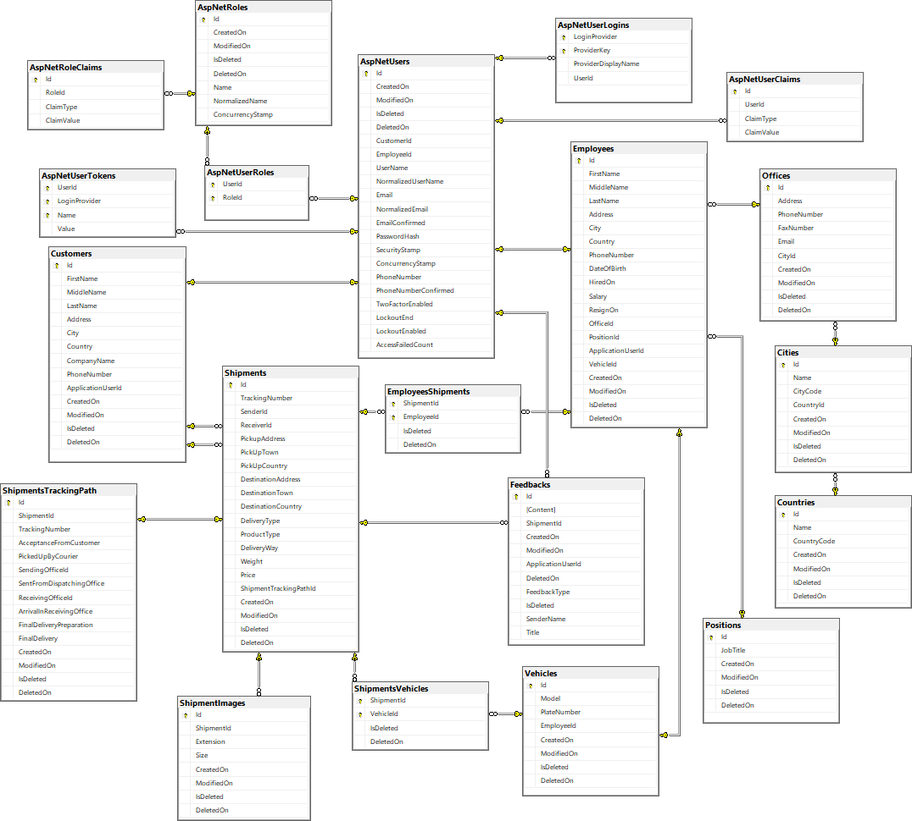

# ExpressEaglesCourier

## :speech_balloon: Short Description

The app is a site of a courier company where staff can perform part of their duties, customers can get in contact with the courier and / or provide their feedback regarding received services and also can track status of their shipment processing.

## :package: **Home And Contact Us Pages**

## :floppy_disk: **Database Diagram**

## :performing_arts: **Roles**

**Administrator and Manager**

- Both have full access to all areas starting from Administration Dashboard including overview and CRUD operations in Feedback area, can create / update / delete employee record, deletions in all areas are only their privilege. 

- The manager can assign employees responsible for handling a shipment. 

- They can also search for an employee details by phone number in search section.

**Employee**

- Staff have their own board with information regarding courier company activities.

- The employee can create / edit customers', shipments' (including shipment photos), shipment tracking paths' details. 

- Before creating a new shipment record the employee must have registered as clients the sender and the receiver of the goods. After creating new shipment the employee can edit it, create / update tracking path for the shipment. The manager can assign employees for handling the shipment or delete details related to shipment.

- Searches can be done for customers (by phone number), shipment (by tracking number and separately by 3 different criteria), shipment tracking path (by tracking number).

**Customer**

- After providing phone number on register one can be identified as customer and granted relevant customer role. Thereafter can search by tracking number the status of his / her shipment processing - by accessing shipment tracking path details.

- Can use app as any user can.

**Any User**

- Can order a courier after registering.

- Can provide feedback be it positive or negative or neutral after registering.

## :camera: Screenshots

## :notebook_with_decorative_cover: Built With

- ASP.NET Core Template prepared by: Nikolay Kostov, Vladislav Kramfilov, Stoyan Shopov
- ASP.NET Core MVC
- Entity Framework Core
- Microsoft SQL Server
- AutoMapper
- StyleCop
- HTML Sanitizer
- xUnit
- SendGrid
- Bootstrap 5, HTML, CSS and Font Awesome
- JavaScript

## :open_file_folder: Usage: 

1. Download the project
2. Write your own connection string in appsettings.json in both Web and Data layers
3. Open or download and open MSSQLServer instance
4. On request I will provide SendGrid ApiKey to enable you start the app
5. Start the app and database will be seeded with few data
6. You can use the app by logging in as preliminarily seeded administrator, employee, customer or you can register as new user.

 
| Role  | Username |Password  | 
| ------------- | ------------- | ------------- | 
| Admin   | Admin  |admin200115 | 
| Employee  | IvaStoyanova  |IS123456## | 
| Customer  | Denislav2001  |DK123456## | 

[def]: HomePage.png